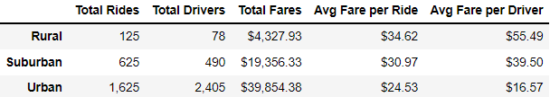

# PyBer_Analysis
The customer has asked for an analysis of the company ride-share data using matplotlib, pandas, and python to visualize and compare data on different city types in order to influence company decison-making. 

## Overview of the analysis

The purpose of this analysis is to visualize data across the three city types: urban, suburban, and rural. This was done in order to see how Pyber is being utilized by clients in these various city types. This data allows a simplified view of the data for informed business decisions based on the data in order to maximize profits. The analysis shows that the majority of the fares comes from urban cities, with the least coming from rural cities. 

## Results

Urban cities had the highest total rides at 1,625, followed by suburban cities at 625 rides, and the least rides were taken in rural cities at only 125 rides. This follows the logic of the respective population sizes of these city types. The total number of drivers also increases from 78 in rural cities, to 490 in suburban cities, and finally to 2,405 in urban cities. Total fares are highest in urban cities, given that those cities had the most rides by 1,000 rides. The total fares were $39,854.38 in urban cities. The total fares were $19,356.33 in suburban cities, and $4,327.93 in rural cities. This is a steep decline in total fares, especially in the rural cities. The average fare per ride in urban cities was $24.53, $30.97 in suburban cities, and $34.62 in rural cities. This data shows that fares are most expensive in rural cities, likely due to the smaller number of PyBer drivers. The average fare per driver is $55.49 in rural cities, $39.50 in suburban cities, and $16.57. This also shows that the price per driver is highest in rural cities and lowest in urban cities. 

## Summary 
 Based on the results, provide three business recommendations to the CEO for addressing any disparities among the city types.

